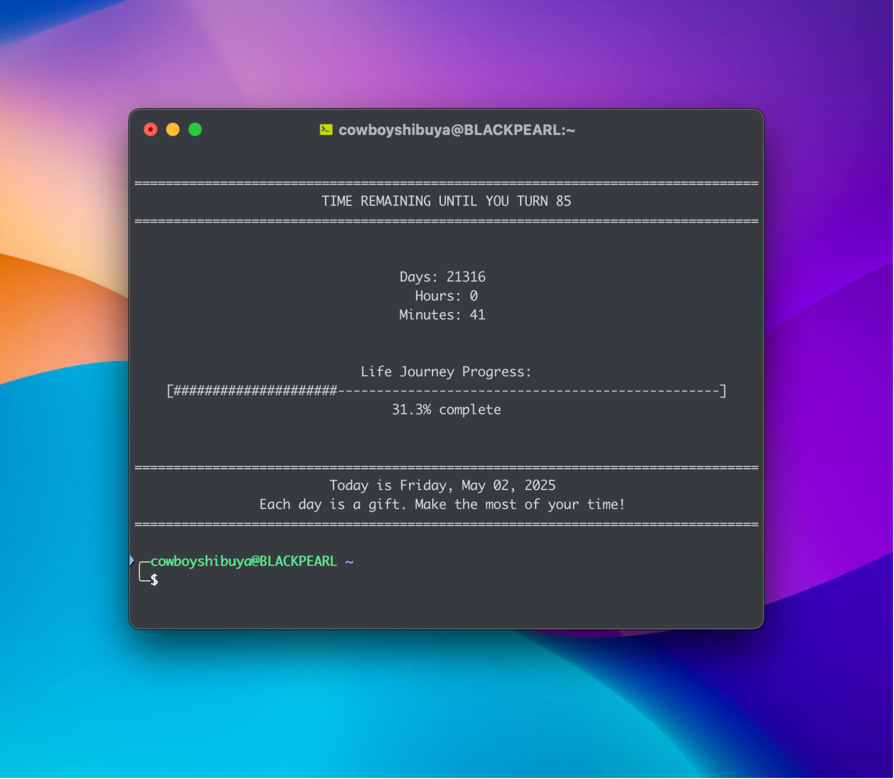

# daysleft-CLI
A simple Python tool that displays time remaining until you reach a specific age. This terminal-base app shows you days, hours and minutes left, with a simple visual progress bar reprensenting your life journey.

 "Example visual"

## Description
Think of it like a personal dashboard that reminds you the value of time each time you open your terminal.

## Features

- Simple, terminal-sized display that adapts to your window
- Visual progress bar showing your life journey progress
- Command-line arguments for customizing birthdate and target age
- Daily inspirational message

## Installation

### 1. Clone this repo: 
git clone https://github.com/cowboyshibuya/daysleft-CLI.git
cd daysleft-CLI

### 2. Make the script executable
chmod +x daysleft-CLI.py

## Usage
Run the script with your birthdate and target age as args: 
./countdown.py YYYY-MM-DD TARGET_AGE 

### Example: 
./countdown.py 1998-09-12 85

## Auto-start with Terminal
To have the coundown display every time you open a terminal:

### 1. Edit your shell's startup file

bash : 
echo "./path/to/countdown.py YOUR_BIRTHDATE TARGET_AGE" >> ~/.bashrc

Zsh:
echo "./path/to/countdown.py YOUR_BIRTHDATE TARGET_AGE" >> ~/.zshrc

### 2. Reload your config
source ~/.bashrc  # or ~/.zshrc

## Contributing
Contributions are welcome! Feel free to submit a Pull Request.

## Future Improvements
- Color-coded progress bar
- Random quote